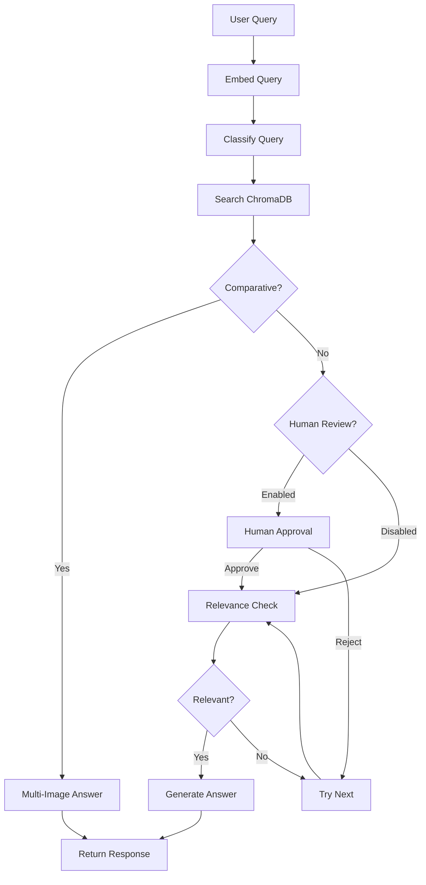

# Vision RAG Agent 🔍

A **LangGraph-powered** visual Retrieval-Augmented Generation system for understanding and querying images using state-of-the-art AI.

## ✨ Features

- 🔄 **Self-correction**: Reflexion pattern to verify image relevance
- 👤 **Human-in-the-loop**: Interactive approval with LangGraph interrupts  
- 🔀 **Multi-image comparison**: LLM-classified comparative queries
- 📊 **LangSmith tracing**: Full observability of agent flow
- 🔌 **OpenRouter**: Flexible model selection (Gemini, Grok, GPT, Claude)
- 🖼️ **Cohere Embed-4**: State-of-the-art multimodal embeddings
- 💾 **ChromaDB**: Persistent vector storage
- 📄 **PDF support**: Extract and index pages as images

## Architecture



## Quick Start

### 1. Install Dependencies
```bash
pip install -r requirements.txt
```

### 2. Configure API Keys
```bash
cp .env.example .env
# Edit .env with your API keys
```

Required:
- **OpenRouter**: [openrouter.ai/keys](https://openrouter.ai/keys)
- **Cohere**: [dashboard.cohere.com/api-keys](https://dashboard.cohere.com/api-keys)

Optional:
- **LangSmith**: [smith.langchain.com](https://smith.langchain.com)

### 3. Run the App
```bash
streamlit run app.py
```

## Key Capabilities

### Multi-Image Comparison 🆕
The agent automatically detects comparative queries and analyzes multiple images:
```
"Which company has the highest profit margin?"
→ LLM classifies as COMPARATIVE
→ Retrieves Nike, Tesla, Netflix images
→ Compares all and answers: "Netflix at 27%"
```

### Human-in-the-Loop
When enabled, the graph pauses using LangGraph interrupts:
- Preview retrieved image before analysis
- **Approve** to continue or **Reject** to try next
- Proper state persistence with MemorySaver checkpointer

### Self-Correction (Reflexion)
1. Retrieves top-k images from vector store
2. LLM checks: "Is this relevant to the query?"
3. If not, tries next candidate (up to max retries)
4. Only answers when confident in relevance

## Model Selection

| Model | Provider | Speed | Cost |
|-------|----------|-------|------|
| Gemini 2.5 Flash | Google | ⚡⚡⚡ | $ |
| Grok 4.1 Fast | xAI | ⚡⚡⚡ | $ |
| Gemini 2.0 Flash | Google | ⚡⚡ | $ |
| GPT-4o Mini | OpenAI | ⚡⚡ | $$ |
| Claude 3.5 Haiku | Anthropic | ⚡⚡ | $$ |

## Project Structure

```
vision_rag/
├── src/
│   ├── config.py         # API and model configuration
│   ├── state.py          # Pydantic state models
│   ├── tools.py          # Embeddings, ChromaDB, PDF processing
│   ├── nodes.py          # LangGraph nodes (classify, answer, etc.)
│   └── graph.py          # Graph construction with interrupts
├── tests/
│   ├── run_tests.py      # Automated test runner
│   └── test_baselines.py # Test cases with ground truth
├── app.py                # Streamlit UI
├── requirements.txt
├── .env.example
└── README.md
```

## Testing

Run the automated test suite:
```bash
# Full suite with Gemini 2.5 Flash
python tests/run_tests.py --run --model gemini-2.5-flash

# Specific test
python tests/run_tests.py --run --id comp_001

# Setup test images
python tests/run_tests.py --setup
```

**Latest results**: 26/26 tests passing (100%)

## Technologies

- **[LangGraph](https://github.com/langchain-ai/langgraph)**: Agent orchestration with interrupts
- **[Cohere Embed-4](https://cohere.com)**: Multimodal embeddings
- **[OpenRouter](https://openrouter.ai)**: Multi-provider LLM gateway
- **[ChromaDB](https://www.trychroma.com)**: Vector database
- **[Streamlit](https://streamlit.io)**: Web UI
- **[LangSmith](https://smith.langchain.com)**: Observability

## License

MIT
